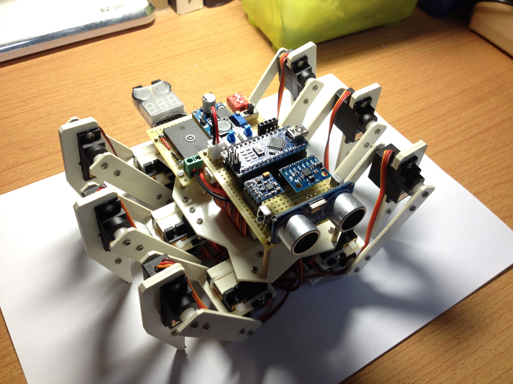
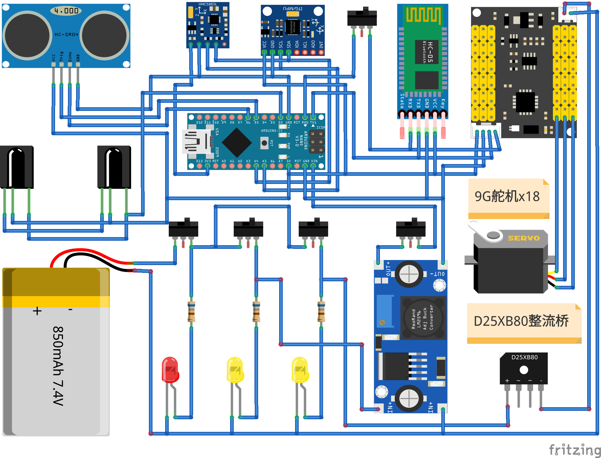

# hexapod_bionic_robot



## Description

This code repository contains the Arduino embedded codes for hexapod bionic robot. It uses Arduino and multiple sensors to complete the robot's walking, obstacle avoidance, remote control and other functions.

## Principle



## Video

The following video show the basic function of the [hexapod_bionic_robot](https://www.bilibili.com/video/BV1oJ411Q7Us/).

## Configure

1. Please connect lines correctly.
2. Doanload repository to local computer:

  ```sh
  $> cd Desktop
  $> git clone https://github.com/myyerrol/hexapod_bionic_robot.git
  ```

3. Copy `arduino/HexapodBionicRobot/` directory to `Arduino/libraries/`:

  ```sh
  $> cd ~/Desktop/hexapod_bionic_robot
  $> cp -r arduino/HexapodBionicRobot/ ~/Arduino/libraries/
  ```

4. Start **Arduino IDE**, select `File/Examples/HexapodBionicRobot/hexapod_bionic_robot_test`.

5. Compile code and upload to arduino.

## Summary

In fact, when I saw the hexapod robot stand up on its own strength for the first time, my heart was very excited. Although the robot's feet will squeak slightly when it supports the ground because of the small moment of the steering gear, hexapod robots can make many complex actions that can not be done by robots thanks to eighteen degrees of freedom of joints. I think this may be the charm of multi-legged robots!
